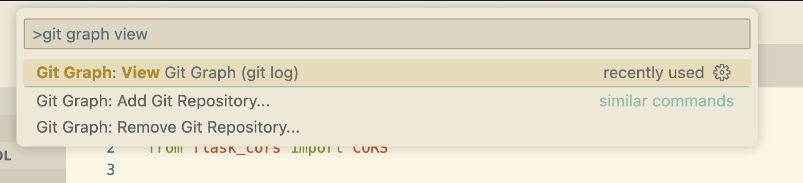

# Git reset - I committed code I don't want!

## Overview

We will start building our School app frontend and backend, and, make some mistakes along the way. We'll `git add` ("stage") code we don't want, commit staged changes we don't want, and push commits with code we don't want to github (our remote). And we'll learn how to safely use `git reset` to handle each of these changes.

These are the scenario's we'll see how to handle:

1. "I staged (added) code I don't want to commit, but I didn't commit it yet." --> `git reset --staged`

2. "I committed code I don't want, but didn't push it yet." --> `git reset --soft`

3. "I committed and pushed code I don't want" --> `git reset --soft` plus a force push.

And, for each scenario, **being specific in our git commands** and **making backups**, to give us an extra degree of safety.

## Git reset

`git reset` is a very powerful command. Use it with caution, and take time to confirm you understand the command you're going to run. Soon you will build up familiarity and be able to use it more fluidly.

We will focus on `git reset --staged`, `git reset --soft`, and with caution, force-pushing, and, `git reset --hard`.

Just like other git commands, we can use *glob patterns* with `git reset` -- such as `git reset *.js`

## Scenario 1: "I added code I don't want to commit"

We'll see how to use `git reset --staged` safely in this scenario.

Let's start writing our backend for our School. Install our python dependencies and get some skeleton code going for our school API.

```bash
python -m venv .venv
pip install flask flask_cors
pip freeze > requirements.txt
```

Now make the backend skeleton code. A basic "hello world" endpoint and a "get_students" endpoint with some fake data:

```python
from flask import Flask, jsonify
from flask_cors import CORS

app = Flask(__name__)
CORS(app)

class Student:
    """student"""
    def __init__(self, data):
        self.id = data.get('id')
        self.name = data.get('name')

all_students = []
# Add some students
all_students.append(Student({'id': 1, 'name': 'Harry'}))
all_students.append(Student({'id': 2, 'name': 'Hermione'}))
all_students.append(Student({'id': 2, 'name': 'Ron'}))

@app.route('/', methods=['GET'])
def base_route():
    return "ping"

@app.route('/students', methods=['GET'])
def get_students():
    """get all students"""
    student_list = [
        {'id': student.id, 'name': student.name}
        for student in all_students
    ]
    return jsonify(student_list)

app.run(debug=True)
```

Now create a README and put some install / run instructions in it:

```bash
touch README.md
```

```txt
# Backend README

## Installation

1. Create python virtual environment: `python -m venv .venv`
2. Activate virtual env & Install dependencies: `source .venv/bin/activate && pip install -r requirements.txt`

## Getting Started

1. `python app.py`
2. Test that http://127.0.0.1:5000 and http://127.0.0.1:5000/students are returning data

Your backend is running!
```

Now let's `git add` everything, to add all our work to git's "staging area", or "Staging Index"

```bash
git add .
```

Awesome!  Except ...

Uh-oh! We were in the zone, and without intending too, commited something we don't want in version control, like, say, the `.venv` python virtual environment directory.

`git status` shows us we've staged the whole `.venv` directory, which is not what we want to do.

No worries!

### Use `git reset --staged` to un-stage changes

We can "un-stage" our `.venv` directory without deleting it or any of our code. Two warnings:

1. None of our work is committed yet. If we do goof and delete it, it's gone. When doing this, take your time.

2. Same as above. If you have any work that is really critical, *copy and paste it into a file outside your git repo* as a "just-in-case" backup.

Because of this, we will *tell git to only un-stage the `.venv` directory*.

Run this command: `git reset --staged .venv`. We have just told git to un-stage the `.venv` directory, and only the `.venv` directory. Even if we screw up the reset command, being more specific limits the risk. Let's run `git status` and see how we did.

Good! The `venv` directory is un-staged and back in our "working directory", or "working tree", where we edit our code and such.

Let's create a `.gitignore` file and use it to ignore the `.venv` directory moving forward:

```bash
echo ".venv" > .gitignore
```

Run `cat .gitignore` to confirm the file looks right, and, let's add (or "stage") that file to be committed too: `git add .gitignore`

Now run `git status`. Everything should look good. Let's run `git commit`, write a commit message, and confirm with `git status` that our repo looks good.

Let's push our code up to github in case something happens to our laptop! `git push`

Finally, let's use the [Git Graph VS Code Extension](https://marketplace.visualstudio.com/items?itemName=mhutchie.git-graph) to visually look at our commits. Use the VS Code command palette (cmd-shift-p or ctrl-shift-p) and type "git graph view":

!

## Scenario 2: I commited code I don't want but haven't pushed yet

We will see how to safely use `git reset --soft` to handle this.

## Scenario 3: I committed code I don't want **and** pushed it **Caution!!!**

This scenario requires extra caution and we will see how to safely handle it using `git reset --soft` and a force push.

## Conceptual Review

### The "Three Trees": Working Directory, Staging Directory / Index, HEAD

#### Working Directory

#### The Index or "Staging Area"

#### HEAD - most recent commit snapshot

### What is a commit? What is a commit hash?

### What is HEAD?

## References

[Git Reset and "The Three Trees"](https://www.atlassian.com/git/tutorials/undoing-changes/git-reset)
