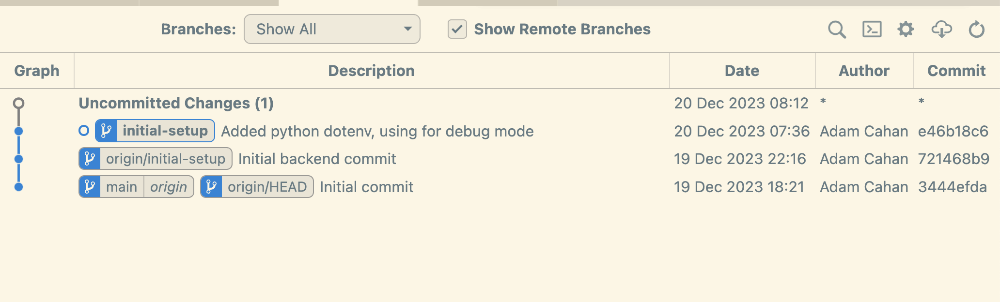
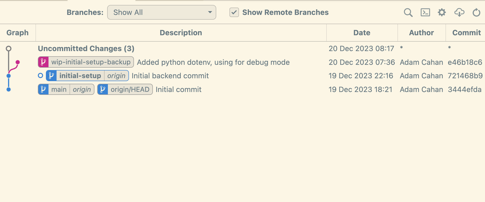

# Git reset - I committed code I don't want!

## Overview

We will start building our School app frontend and backend, and, make some mistakes along the way. We'll `git add` ("stage") code we don't want, commit staged changes we don't want, and push commits with code we don't want to github (our remote). And we'll learn how to safely use `git reset` to handle each of these changes.

The commands we'll examine are:

- `git restore`
- `git reset`
- `git log`
- `git diff`

The concepts we'll look at are:

- `HEAD`
- Commit hashes & Refs
- "The Three Trees"
- Force-pushing

The scenario's we'll see how to handle:

1. "I staged (added) code I don't want to commit, but I didn't commit it yet." --> `git restore --staged`

2. "I committed code I don't want, but didn't push it yet." --> `git reset --soft`

3. "I committed and pushed code I don't want" --> `git reset --soft` plus a force push.

And, for each scenario, **being specific in our git commands** and **making backups**, to give us an extra degree of safety.

## Git reset

`git reset` is a very powerful command. Use it with caution, and take time to confirm you understand the command you're going to run. Soon you will build up familiarity and be able to use it more fluidly.

We will focus on `git restore --staged`, `git reset --soft`, and with caution, force-pushing, and, `git reset --hard`.

Just like other git commands, we can use *glob patterns* with `git reset` -- such as `git reset *.js`

## Scenario 1: "I added code I don't want to commit"

We'll see how to use `git restore --staged` safely in this scenario.

### Implementation

Let's start writing our backend for our School. Install our python dependencies and get some skeleton code going for our school API.

**First let's create an `initial-setsetup` branch**: `git checkout -b initial-setup`

```bash
python -m venv .venv
pip install flask flask_cors
pip freeze > requirements.txt
```

Eventually we'll have a frontend and backend, so let's make directories for both, an empty README, and navigate to the `backend/` directory to start work:

```bash
touch README.md
mkdir frontend backend
cd backend
```

Now make the backend skeleton code. A basic "hello world" endpoint and a "get_students" endpoint with some fake data:

```python
from flask import Flask, jsonify
from flask_cors import CORS

app = Flask(__name__)
CORS(app)

class Student:
    """student"""
    def __init__(self, data):
        self.id = data.get('id')
        self.name = data.get('name')

all_students = []
# Add some students
all_students.append(Student({'id': 1, 'name': 'Harry'}))
all_students.append(Student({'id': 2, 'name': 'Hermione'}))
all_students.append(Student({'id': 2, 'name': 'Ron'}))

@app.route('/', methods=['GET'])
def base_route():
    return "ping"

@app.route('/students', methods=['GET'])
def get_students():
    """get all students"""
    student_list = [
        {'id': student.id, 'name': student.name}
        for student in all_students
    ]
    return jsonify(student_list)

app.run(debug=True)
```

Now create a README and put some install / run instructions in it:

```bash
touch README.md
```

```txt
# Backend README

## Installation

1. Create python virtual environment: `python -m venv .venv`
2. Activate virtual env & Install dependencies: `source .venv/bin/activate && pip install -r requirements.txt`

## Getting Started

1. `python app.py`
2. Test that http://127.0.0.1:5000 and http://127.0.0.1:5000/students are returning data

Your backend is running!
```

Now let's `git add` everything, to add all our work to git's "staging area", or "Staging Index"

```bash
git add .
```

Awesome!  Except ...

Uh-oh! We were in the zone, and without intending too, commited something we don't want in version control, like, say, the `.venv` python virtual environment directory.

`git status` shows us we've staged the whole `.venv` directory, which is not what we want to do.

No worries!

### Use `git restore --staged` to un-stage changes

We can "un-stage" our `.venv` directory without deleting it or any of our code. Two warnings:

1. None of our work is committed yet. If we do goof and delete it, it's gone. When doing this, take your time.

2. Same as above. If you have any work that is really critical, *copy and paste it into a file outside your git repo* as a "just-in-case" backup.

Because of this, we will *tell git to only un-stage the `.venv` directory*.

We will **not** do `git restore --staged .`, as, the "." pattern will un-stage *all* files and if we make a mistake and use `reset --hard` instead of `restore --staged` we'll lose all our work!

Run this command: `git restore --staged .venv`. We have just told git to un-stage the `.venv` directory, and only the `.venv` directory. Even if we screw up the reset command, being more specific limits the risk. Let's run `git status` and see how we did.

Good! The `venv` directory is un-staged and back in our "working directory", or "working tree", where we edit our code and such.

Let's create a `.gitignore` file and use it to ignore the `.venv` directory moving forward:

```bash
echo ".venv" > .gitignore
```

Run `cat .gitignore` to confirm the file looks right, and, let's add (or "stage") that file to be committed too: `git add .gitignore`

Now run `git status`. Everything should look good. Let's run `git commit`, write a commit message, and confirm with `git status` that our repo looks good.

Let's push our code up to github in case something happens to our laptop! `git push`

Finally, let's use the [Git Graph VS Code Extension](https://marketplace.visualstudio.com/items?itemName=mhutchie.git-graph) to visually look at our commits. Use the VS Code command palette (cmd-shift-p or ctrl-shift-p) and type "git graph view":

!

## Scenario 2: I commited code I don't want but haven't pushed yet

We will see how to safely use `git reset --soft` to handle this.

### Implementation

Let's update our flask app to use the `python-dotenv` library so we can load environment variables from an `.env` file.

And, let's do this on a new branch. Use `git status` to confirm our current branch is `initial-setup`, then *branch off that branch* like so:

```bash
git checkout -b backend-use-dotenv
```

Perfect! Now install the dependency and update `requirements.txt`, and confirm it's correct:

```bash
pip install python-dotenv
pip freeze > requirements.txt
cat requirements.txt
```

Now let's create a `.env` file. Inside we'll put a `FLASK_ENV` var to tell if we're running our app in "dev" or "prod", and an imaginary `MY_SECRET_API_KEY` var. Create the `.env` file and put this in it:

```bash
FLASK_ENV=dev
MY_SECRET_API_KEY=xyz123
```

Now let's use `FLASK_ENV`` to tell the flask app whether "debug mode" should be enabled or not. In `app.py` add the following, right after our other imports:

```python
import os
from dotenv import load_dotenv

load_dotenv() # Loads vars in .env file so we can now use `os.environ['MY_VAR]`
print(os.environ['FLASK_ENV'])
print(os.environ['MY_SECRET_API_KEY'])
```

Now use `FLASK_ENV` to set debug mode. At the bottom of `app.py` add this code and **modify** our `app.run()` call to look like this:

```python
IS_DEBUG_ENABLED = False
if os.environ['FLASK_ENV'] == "dev":
    IS_DEBUG_ENABLED = True

app.run(debug=IS_DEBUG_ENABLED)
```

Run `python app.py` to confirm it works.

Now add and commit our code! Run:

```bash
git add .
git commit -m 'Added python dotenv, using for debug mode'
git status
git log
```

You should see something like:

```bash
On branch initial-setup
Your branch is ahead of 'origin/initial-setup' by 1 commit.
  (use "git push" to publish your local commits)

commit e46b18c6f3a74c1fc347ec9a831f7a9f63eda06e (HEAD -> initial-setup)
Author: Adam Cahan <adam.cahan@gmail.com>
Date:   Wed Dec 20 07:36:51 2023 -0600

    Added python dotenv, using for debug mode
```

Our working tree is clean, we are good-to go. Uh-oh! We ... committed the `.env` file.

### Use `git reset --soft`

We can use `git reset --soft HEAD~1`. We will:

1. Make a backup branch in case we make a mistake
2. "Un-commit" our **most recent** commit.
3. **Not** lose or destroy this code. Our most recent commit will become **staged**
4. Use `git reset --staged` to **un-stage** the `.env` file
5. Make a commit with the code we want.

But ...

#### What is `HEAD`?

Every commit in git has a *commit hash*, a uniqu ID. That's the long string we see by each commit message when we run `git log`.

`HEAD` is an example of what git calls a **ref**, which is short for *reference*. `HEAD` is just a var pointing to the most recent *commit hash* on our current branch

Git stores everything for each local repo in the `.git` directory for each project.

Let's look at it, it's in our project root:

```bash
cd ..
cd .git
ls
```

#### Caution: **DON'T** mess with the .git/ dir

> Unless you know what you're doing and why, you should almost never need to directly modify anything in `.git` or delete the directory. If you do find yourself about to do this and you're not 100%, definitely get help from someone else before proceeding.

You should see this:

```bash
COMMIT_EDITMSG  ORIG_HEAD       description     index           logs            packed-refs
HEAD            config          hooks           info            objects         refs
```

Now run `cat HEAD`, you'll see:

```bash
ref: refs/heads/initial-setup
```

Interesting! The `HEAD` file has our branch name. Hmm, there is a `refs/` dir, let's look at that. Run `ls refs`:

```bash
heads   remotes tags
```

Now run these commands:

```bash
ls refs/heads
ls refs/heads/initial-setup
cat refs/heads/initial-setup
```

You should see:

```bash
initial-setup   main
refs/heads/initial-setup
e46b18c6f3a74c1fc347ec9a831f7a9f63eda06e
```

**NOTE: Your actual commit hash will be different.**

We just learned how git internally stores the "ref" for the `HEAD` of each branch! It's just a text file that has the **commit hash** of the **most recent** commit for that branch.

Whenever we switch branches, git just grabs the right `HEAD` ref for that branch.

#### What is `HEAD~1`?

That is part of the mystery! We now understand `HEAD`. But the command we are about to run is:

```bash
git reset --soft HEAD~1
```

What is the `~1` part? The tilde (`~`) and the number indicate **how many commits back** this command should be run.

Let's use the `git diff` command, which *compares* commits, to examine this. Git diff lets us compare **between commits**, and between our "Staged Area" or Index code and commits. Run:

```
cd ../backend
echo "print('hello') > foo.py
git diff HEAD
```

We just created a file `foo.py`, but it's not staged yet. Diffing against HEAD (most recent commit shows nothing). Run:

```bash
git add foo.py
git diff HEAD
```

You should see:

```
diff --git a/backend/foo.py b/backend/foo.py
new file mode 100644
index 0000000..ed0f110
--- /dev/null
+++ b/backend/foo.py
@@ -0,0 +1 @@
+print('hello')
```

Our Index (staged/added code), has a *difference* relative to our most recent commit, now that we've added `foo.py`.

Run `git diff HEAD~1`, and then `git diff HEAD~2`. You should see a bunch of code printed out. This is the *difference* between our index/current head and the previous commit, or the difference from 2 commits back, and so on.

Use the git graph VS Code plugin to help visualize our branch history:



Go ahead and `rm foo.py` and run `git diff HEAD~1` and `git diff HEAD~2` again - we are comparing our `HEAD` commit against other previous commits on the branch!

#### Running git reset --soft

Now that we understand our command, let's use it! But first, a backup branch in case we error:

```bash
git status
git checkout -b wip-initial-setup-backup
git checkout -
```

`git checkout -` is a useful command that switches us back to the last branch we used. We now have a backup branch, in case our reset command goes wrong. Run:

```bash
git reset --soft HEAD
git status
```

You should see:

```bash
On branch initial-setup
Your branch is up to date with 'origin/initial-setup'.

Changes to be committed:
  (use "git restore --staged <file>..." to unstage)
        new file:   .env
        modified:   app.py
        modified:   requirements.txt
```

In git graph you should see:



We have:

- Un-commited our last commit on our branch without losing code. We can now modify it.
- We still have that commit on a backup branch, in case something goes wrong.

Run:

```bash
git restore --staged .env
git status
git commit -m 'Add dotenv to flask'
git status
git push
```

And now we have removed the `.env` file from our last commit! And done so safely.

## Scenario 3: I committed code I don't want **and** pushed it **Caution!!!**

This scenario requires extra caution and we will see how to safely handle it using `git reset --soft` and a force push.

## Review

### Concepts

- The "Three Trees": Working Directory, Staging Directory / Index, HEAD

- Working Directory

- The Index or "Staging Area"

- What is a commit? What is a commit hash?

- What is HEAD?

### Mini-quiz

1. Does `git restore --staged` ever delete code entirely from our repo? Does it remove code from the "Working Directory"?
2. Does `git reset --soft` ever delete code entirely from our repo? Does it remove code from HEAD, the commit snapshot?
3. Does `git reset --hard` ever delete code entirely from our repo?

## References

[Git restore](https://stackoverflow.com/questions/58003030/what-is-the-git-restore-command-and-what-is-the-difference-between-git-restor)

[Git Reset and "The Three Trees"](https://www.atlassian.com/git/tutorials/undoing-changes/git-reset)


[Git refs - what you need to know](https://www.atlassian.com/git/tutorials/refs-and-the-reflog)